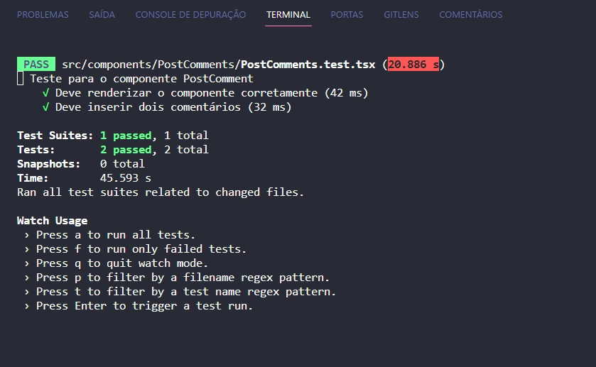

# Requisitos
## Instalar as dependências
`npm install` ou `yarn install`

## Para executar os testes
`npm run test` ou `yarn test`

## Para executar a aplicação em localhost
`npm start` ou `yarn start`

# Para o exercício
O arquivo onde o teste deve ser escrito está em src/components/PostComments/PostComments.test.tsx

## Requisitos
- Criar um código para testar a inserção de dois comentários;
- Utilizar o atributo data-testid;
- Atualizar o repositório com o teste criado;

## Resolução
Neste repositório existe uma branch chamada **resolucao** com o exercício resolvido, é importante que a utilize como consulta caso tenha dificuldades ou até mesmo para comparar com a abordagem que você adotou, **não faça simplesmente um copiar/colar** - confio em você ;)

imagem do terminal com o teste realizado:
